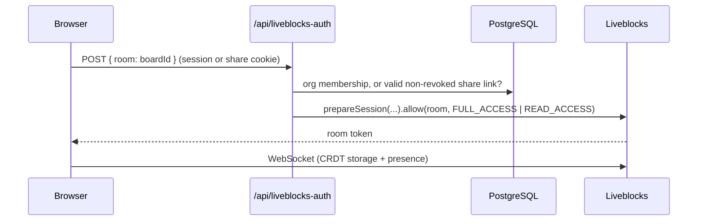

# CollabBoard — Real-Time Collaborative Whiteboard

A Miro-style collaborative whiteboard built with Next.js. Multiple users draw, move, and align shapes on a shared canvas in real time, organized around teams with role-based access.

## Screenshots


## Features

### Canvas
- **Shapes:** rectangle, ellipse, diamond, line/arrow, sticky note, text, and freehand pen drawing
- **Real-time multiplayer:** cursors, selections, and live editing powered by Liveblocks (CRDT-based sync) — every shape, move, and edit streams to everyone in the room with no polling or reload
- **Alignment & distribution:** align left/center/right/top/middle/bottom and distribute spacing evenly, for 2+ (align) or 3+ (distribute) selected objects at once, as a single undo step
- **Multi-select resize:** dragging a corner on a multi-object selection scales every selected shape together, proportionally, from its own original size — not just the first one
- **Shift-to-lock aspect ratio** when resizing a single shape (keeps circles circular, squares square)
- **Zoom & pan:** scroll to pan, Ctrl/Cmd+scroll or trackpad pinch to zoom toward the cursor, on-screen zoom controls, and Ctrl/Cmd +/-/0 shortcuts
- **Keyboard shortcuts:** V/R/O/D/L/T/N/P to switch tools, Delete/Backspace to remove, Ctrl/Cmd+D to duplicate, arrow keys to nudge (Shift for 10px steps), Escape to deselect
- **Read-only share links:** share links can grant either full edit access or view-only access to an anonymous guest

### Platform
- **Custom authentication** — email/password auth built from scratch with JWT (`jose`) session tokens in httpOnly cookies and `bcrypt` password hashing; no third-party auth provider
- **Multi-tenant organizations** — users can belong to multiple teams simultaneously, each with `ADMIN`/`MEMBER` roles and its own set of boards
- **Two invite flows:** email invites that create a full account and org membership, and anonymous share links (editable or read-only) that need no account
- **Favorites, search, and board management** — rename, delete, and organize boards per team
- **Email verification and password reset** flows with time-limited tokens

## Tech Stack

- **Framework:** Next.js 16 (App Router, server actions), React 19
- **Language:** TypeScript
- **Database:** PostgreSQL via Prisma 7 (local development in Docker)
- **Real-time:** Liveblocks (presence, storage, and room-based access control)
- **Auth:** Custom-built — `jose` for JWT, `bcrypt` for password hashing, httpOnly cookies for sessions
- **Email:** Resend
- **State:** Zustand
- **UI:** Tailwind CSS, shadcn/ui
- **Quality:** Vitest, Playwright, ESLint, GitHub Actions

## Getting Started

Requirements: Node 22+, Docker.

```bash
cp .env.example .env        # then fill in AUTH_SECRET, LIVEBLOCKS_SECRET_KEY, RESEND_API_KEY
npm install
npm run db:up               # starts PostgreSQL in Docker (waits until healthy)
npx prisma generate
npm run db:migrate          # applies migrations to the local database
npm run dev
```

Useful scripts: `npm run db:down` (stop the DB, keep data), `npm run db:reset` (wipe the DB volume and re-apply migrations), `npm run lint`, `npm run typecheck`, `npm test`, `npm run test:e2e` (see [`e2e/README.md`](e2e/README.md) for what it needs).

Environment variables: see [`.env.example`](.env.example). `EMAIL_FROM` is optional.

## Architecture

### Access model

Every request is authorized in layers, so no single check is a single point of failure:

1. **`proxy.ts`** verifies the session JWT at the edge, redirects unauthenticated visitors to `/login` (keeping a `callbackUrl`), and bounces logged-in users away from auth pages. Public routes are matched by exact path segment, so `/board` is public but `/boardroom` is not.
2. **Server actions and pages** re-check the session and the caller's role themselves (`requireUser`, `requireOrgMember`, `requireOrgAdmin`). The proxy is a UX layer, not the security boundary.
3. **Liveblocks room access** is decided per request by `/api/liveblocks-auth`, which issues a `FULL_ACCESS` or `READ_ACCESS` room token based on org membership or a share link's own `canEdit` flag — this is the actual enforcement boundary for edit permissions, not the client UI (which only *hides* editing controls for a read-only guest as a courtesy).

### Realtime authorization



Board content (the layer map and z-order list) lives in Liveblocks storage; users, teams, boards metadata, invites, and share links live in PostgreSQL. Share links set a per-board cookie, and guests get an anonymous `guest:<uuid>` identity.

### Data model

`User` ↔ `Membership` (role) ↔ `Organization` → `Board`. `Invite` (email + role + expiry) attaches a new user to an organization at registration. `BoardShareLink` (`canEdit`, expiry, revoked) grants anonymous access to one board. Verification and password-reset tokens are single-purpose, time-limited rows.

### Authentication

- Passwords are hashed with `bcrypt`; sessions are 30-day HS256 JWTs in an `httpOnly`, `SameSite=Lax` cookie (`Secure` in production).
- Login returns the same error for an unknown email and a wrong password. Password reset always returns the same response, whether or not the account exists.
- Unverified accounts cannot sign in; a fresh verification email is sent instead.
- The sign-in, registration, and forgot-password endpoints are rate limited per IP (`429` with `Retry-After`).
- Expected business errors are thrown as `AppError` and shown to the user as-is. Anything else is logged server-side and replaced with a generic message, so internal errors (for example, a Liveblocks SDK exception or a database connection string) never reach the client as a raw stack trace or an unparsable HTML error page.

## Testing and CI

**Unit tests** (Vitest, mocked Prisma client, no real network) cover server actions, permission checks, JWT/password/token helpers, the rate limiter, the auth API routes (login, registration, password reset, Liveblocks room authorization), the route proxy, and the canvas geometry functions above (alignment, zoom, group-resize, line endpoints) — about 190 tests.

**End-to-end tests** (Playwright, in `e2e/`) drive a real browser against a real Postgres database: login/registration through the actual pages, and — the one thing no unit test can prove — two independent browser sessions (an authenticated owner and an anonymous share-link guest) editing the same board and seeing each other's changes live through Liveblocks.

GitHub Actions runs two jobs: `verify` (lint, typecheck, unit tests) on every push and pull request with no external dependencies, and `e2e` (real Postgres service container + Playwright) that only runs when a `LIVEBLOCKS_SECRET_KEY` repo secret is configured, so it skips cleanly rather than failing on a fork.

```bash
npm test          # unit tests
npm run test:e2e  # end-to-end (needs a real DB + Liveblocks project, see e2e/README.md)
```

## Known Limitations

- The rate limiter keeps its counters in memory, so it works per server instance. For a multi-instance deployment, swap `lib/rate-limit.ts` for a Redis-backed limiter such as Upstash.
- The line/arrow tool always draws an arrowhead at the end; there's no plain-line or no-arrowhead variant yet.
- Alignment is based on each shape's `x`/`y`/`width`/`height` box; for a line that points up-and-right or down-and-left (`flipX`/`flipY`), that box's left edge isn't necessarily the line's visually leftmost point.
- No snapping or connectors between shapes — an arrow doesn't follow a shape it was pointing at if that shape moves.
- A board is capped at 100 layers.
